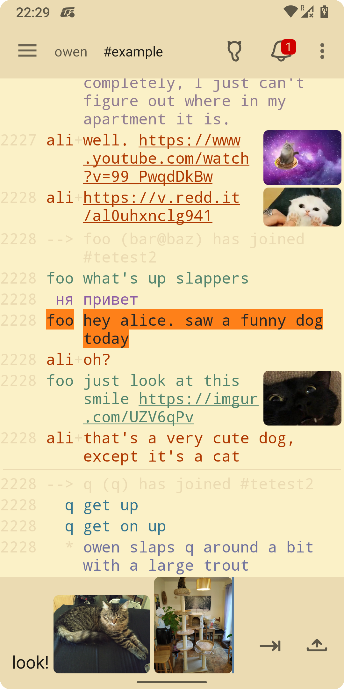
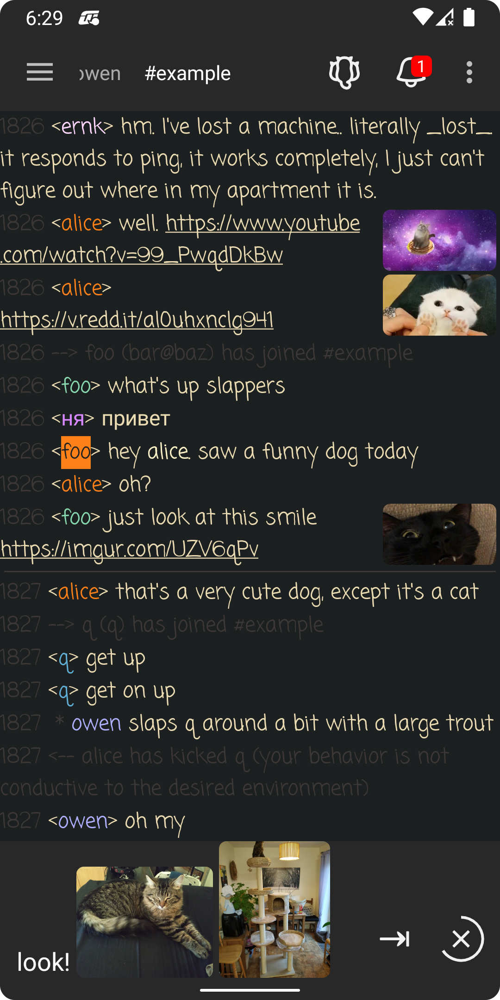
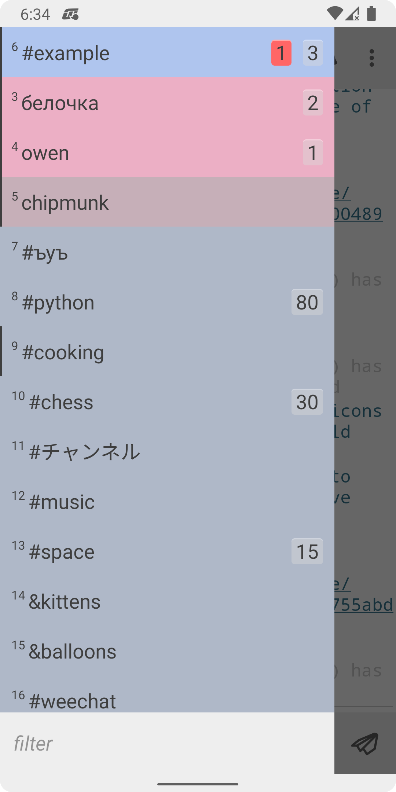
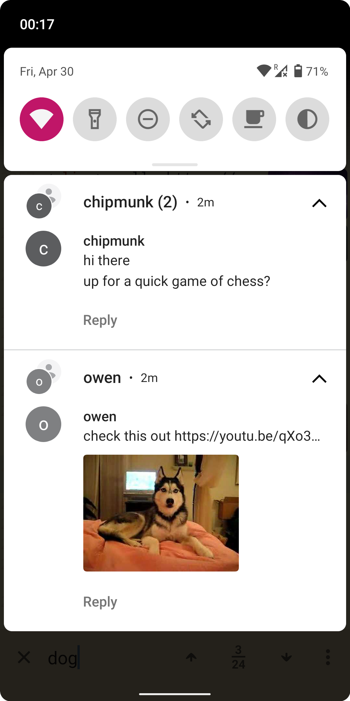
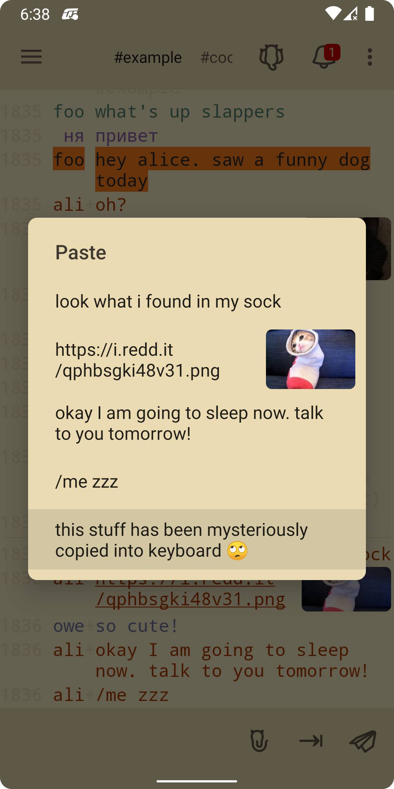
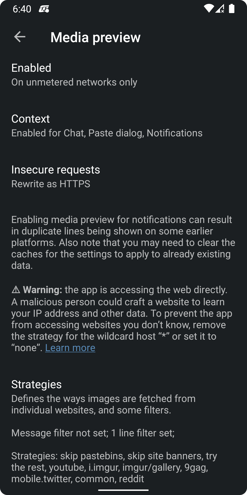

Weechat-Android relay client
==================================
This is a WeeChat relay client for Android.

This application is *not* a standalone an IRC client. It connects to [WeeChat](https://github.com/weechat/weechat) that has to be
running on a remote machine. If you are looking for a standalone IRC client for Android,
you will need to look elsewhere.

 

Follow our [Quickstart guide](https://github.com/ubergeek42/weechat-android/wiki/Quickstart-Guide) 
to get up and running, and don't forget to read the [FAQ](https://github.com/ubergeek42/weechat-android/wiki/FAQ)!

### Bug reports and contributing

Report any bugs or feature requests here on GitHub. You can also find us on #weechat-android 
on irc.libera.chat. When reporting an issue, make sure to include build ID that you can find in Settings → About 
(looks something like “v0.13-123-g1234567”).

If you want to contribute, check out our 
[Getting started with the code](https://github.com/ubergeek42/weechat-android/wiki/Getting-started-with-the-code)
guide. It also includes instructions for building from command line. 
Pull requests are welcome—but please check with us on IRC before starting a substantial rewrite!

### Changelog

##### v1.10
* Added an option to not move hot buffers to the top of the buffer list
* Handle relay events `_buffer_cleared` and `_buffer_line_data_changed`
* Updated the default media preview strategies
* A few minor bug fixes and improvements

##### v1.9
* Drag and drop files on buffers to share
* Volume keys can now navigate input history
* Fixed strange behavior resulting from handling WeeChat pointers as signed numbers
* Fixed importing of PKCS #8 Ed25519 keys
* Target Android API 34, ask for notification & exact alarm permissions where applicable
* A few minor bug fixes and improvements

##### v1.8.1
* Fixed an issue with ED25519 keys during upgrade
* Update Android Gradle Plugin to fix build on F-Droid
* Rework ping logic to comply with Google Play requirements

##### v1.8
* Render the latest emoji on older systems
* Certificate dialog now shows trusted chain if available
* Fixed not being able to connect to servers that require SNI
* Fixed cleartext web traffic not going through
* Fixed wrong message shown in case of TLS error
* Fixed a crash if an URL with the ellipsis character is encountered
* Fixed a very rare inconsistent Bubble behavior

##### v1.7.1
* Fixed an issue of disappearing bubbles

##### v1.7
* Removed storage access permission on Android 9+
* Added launcher and direct share shortcuts
* Added support for Bubbles on Android 11

##### v1.6
* Added search functionality
* Added a floating “go to bottom” button
* Added a connectivity indicator
* Copy dialog can now select text and copy several messages at once
* Interface is no longer locked up while disconnected
* Chat lines are no longer thrown away when not synchronizing
* Chat scroll position is now remembered on rotation
* App is now drawn behind system bars on supported devices
* Added new chat line change animations
* Local tab completer is no longer used when completing command-like text
* A lot of internal changes and bug fixes

##### v1.5.1
* Fixed a crash when the password has never been set
* Fixed a crash when using Modern handshake on Android 7-

##### v1.5
* Added support for the handshake relay command
* Improved the way URLs are recognized
* Black background is no longer shown when switching buffers
* Fixed a couple of rare crashes

##### v1.4.2
* Fixed freeform window mode
* Fixed a few rare crashes

##### v1.4.1
* Fixed a few bugs

##### v1.4
* Implemented command and channel name completion
* Updated icons to have wireframe look

##### v1.3.1
* Fixed F-Droid builds

##### v1.3
* Allow uploading files via user-supplied HTTP POST services
* Added file picker/take photo button
* App can be a share target for files as well as text
* App can receive media through keyboard
* Parts of the app are using Kotlin now!
* Toast background is colored to signify success or failure

##### v1.2
* Let users interactively accept or reject SSH host keys
* Accept private SSH keys in PKCS #8 format

##### v1.1
* Added a new certificate dialog that displays the full certificate chain
* Implemented SSL certificate pinning
* Support for client SSL certificates
* Added support for Ed25519 keys thanks to [sshlib](https://github.com/connectbot/sshlib)
* When possible, RSA, EC, DSA keys are stored inside security hardware

##### v1.0
* Added media preview
* Raised minimum Android version to Lollipop (5.0, API level 21)
* Added German translation
* Improved support for notify levels

##### v0.14
* Added an optional light theme
* Removed some and added some color schemes, including an AMOLED theme
* Support for coloring UI elements through color schemes
* Ability to tweak the 256 color palette through color schemes
* A new adaptive icon
* Modernized some UI elements: rounded corners, lowercase buttons, etc
* Using vector assets almost everywhere
* Reworked a major part of the networking code—should be more stable now
* Use a different WebSocket library: [nv-websocket-client](https://github.com/TakahikoKawasaki/nv-websocket-client)
* Made the order of open buffers consistent with the buffer list
* Added a filter to the share dialog
* Activity is now no longer destroyed when pressing the back button
* Added an option to use a system gesture exclusion zone on Android Q
* Added Russian translation
* Fixed the way the application detects software keyboard
* Fixed some of the notification glitches and inconsistencies
* Now using LeakCanary to detect memory leaks
* Library updates and stability fixes

##### v0.13
* Bundled notifications with instant reply on Android 7+
* A menu switch that instantly turns filtering on or off
* Use RecyclerView that comes with some animations
* Buffer title is now at the top of buffer lines
* Ask user for permission to read external storage
* Library updates and stability fixes

##### v0.12
* Service to run only while connecting/connected; quit button removed
* “Fetch more” button
* SSH library update; require known hosts; store known hosts and key inside app
* Significant refactoring of connectivity; stunnel removed
* Better logging and error handling

##### v0.11 - November 2015
* Material design
* Ping mechanism
* Color schemes
* Read marker line
* Ability to resend lines
* Font preference
* More notification options
* Weechat → relay synchronization every 5 minutes
* Validation of settings
* Better url detection
* A bunch of stability fixes

##### v0.10 - Skipped/unreleased

##### v0.9-rc1 - Oct 25th, 2014
* Too much to list, lots and lots and lots of fixes, UI tweaks, and changes
* Special thanks to @oakkitten and @mhoran for their help and contributions

##### v0.08-dev
* SSL Support
* Swiping to change buffers
* SSH Keyfile support
* Lots of other small things

##### v0.07 - June 13th, 2012
* Tab completion for nicks(tab key or search button)
* Automatic reconnection
* Stunnel support (see: [Stunnel Guide](https://github.com/ubergeek42/weechat-android/wiki/Setting-up-stunnel))
* Text size preference
* Massive performance tweak/bandwidth reduction
* Other bug fixes

##### v0.06 - May 13th, 2012
* Rewrite rendering of chat messages(improved performance)
* Added about screen
* Made links in messages clickable
* Fixed bug with irc colors in topics
* Password now hidden in preferences
* Added preference for prefix alignment
* Keyboard behaves nicer in chats

##### v0.05-dev - May 11th, 2012
* Complete rewrite of the frontend
* Support Notifications
* Background service
* Message filters
* UTF-8 Support(Fixes #1)

##### v.0.04 - Skipped/unreleased

##### v0.03
* Preferences for Colors/Timestamp
* Highlight support for messages
* Misc bugfixes

##### v0.02
* Colors!
* A few bugfixes

##### v0.01
* Initial Release
