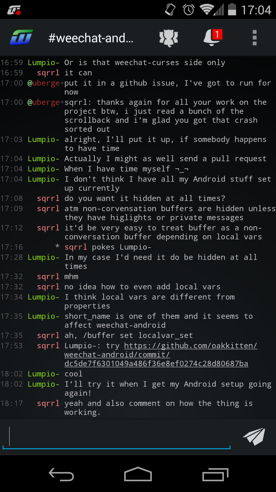
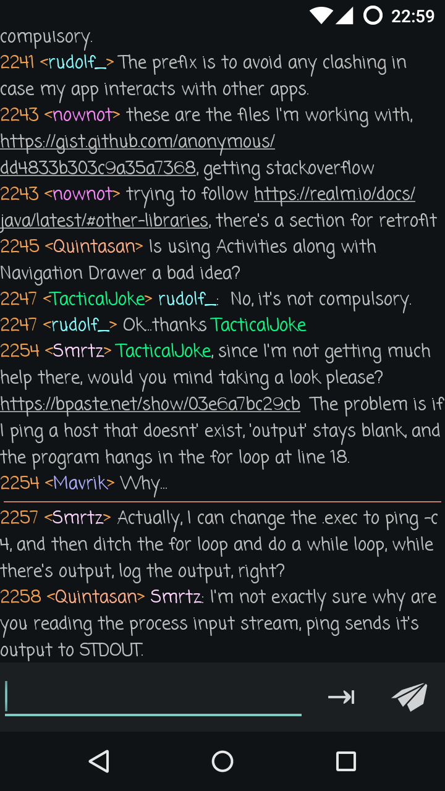
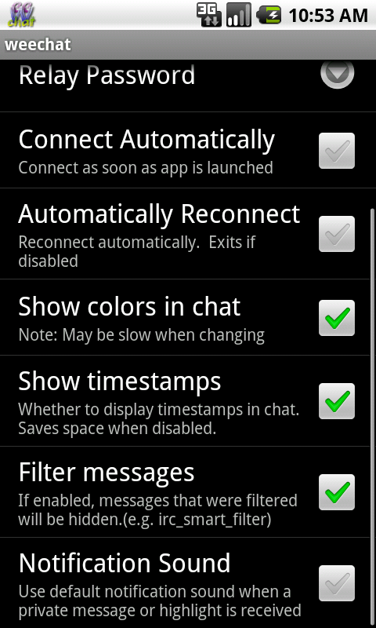
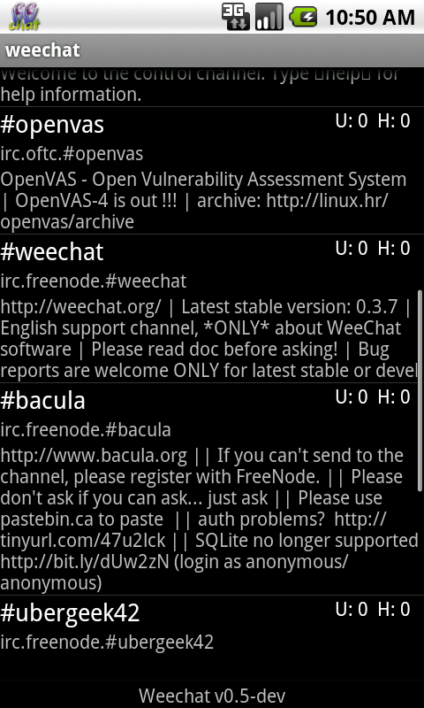
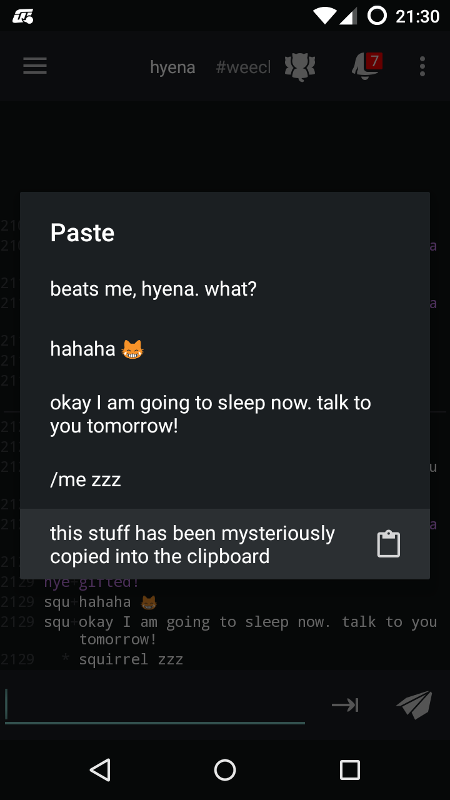

Weechat-Android relay client
==================================
This is a WeeChat relay client for Android.

This application is *not* a standalone an IRC client. It connects to WeeChat that has to be
running on a remote machine. If you are looking for a standalone IRC client for Android,
you will need to look elsewhere.

## Get the app!

#### [Google Play](https://play.google.com/store/apps/details?id=com.ubergeek42.WeechatAndroid)

#### [Amazon](http://www.amazon.com/Keith-Johnson-Weechat-Android/dp/B00OWI1ZRS)

#### [F-Droid](https://f-droid.org/repository/browse/?fdid=com.ubergeek42.WeechatAndroid)

#### Latest Development Snapshot 

If you're feeling adventurous, you can try [the latest development version](http://weechat-android.ubergeek42.com/).
This is built after every commit, and while we try to keep a working build, it may fail or have
major bugs. Use at your own risk.

#### Google Play Nightly Builds
We now have automatic builds published to the google play store as commits are made. This is the
same as the snapshot builds you can get above, just published to the google play store for
convenience. It only includes builds of the master branch. These builds are published to the beta
branch, so you need to be a beta test for this application. To participate, you need to
[“become a tester”](https://play.google.com/apps/testing/com.ubergeek42.WeechatAndroid.dev). After
that either get it from [Google Play](https://play.google.com/store/apps/details?id=com.ubergeek42.WeechatAndroid.dev)
or scan this QR code:

## Installation and usage
Please refer to the [quick start](https://github.com/ubergeek42/weechat-android/wiki/Quickstart-Guide) guide for details.

## Screenshots
Brand new look and feel!

## Bug reports and contributing
Please report any bugs or feature requests here on GitHub (See the Issues tab) or
join #weechat-android on Freenode. Please include the Build Identifier found in the about screen
if possible. Pull requests are welcome!

All of the source code is available right here on GitHub. For additional information see
[the introduction to setting up your IDE](https://github.com/ubergeek42/weechat-android/wiki/Getting-started-with-the-code),
[relay protocol documentation](http://www.weechat.org/files/doc/devel/weechat_relay_protocol.en.html)
and [WeeChat main page](http://www.weechat.org/).

## [FAQ and Tips & Tricks](https://github.com/ubergeek42/weechat-android/wiki/FAQ)

## Changelog

#### v0.11 - November 2015
* Material design
* Ping mechanism
* Color schemes
* Read marker line
* Ability to resend lines
* Font preference
* More notification options
* Weechat → relay synchronization every 5 minutes
* Validation of settings
* Better url detection
* A bunch of stability fixes

#### v0.10 - Skipped/unreleased

#### v0.9-rc1 - Oct 25th, 2014
* Too much to list, lots and lots and lots of fixes, UI tweaks, and changes
* Special thanks to @oakkitten and @mhoran for their help and contributions

#### v0.08-dev
* SSL Support
* Swiping to change buffers
* SSH Keyfile support
* Lots of other small things

#### v0.07 - June 13th, 2012
* Tab completion for nicks(tab key or search button)
* Automatic reconnection
* Stunnel support(see: [Stunnel Guide](https://github.com/ubergeek42/weechat-android/wiki/Setting-up-stunnel))
* Text size preference
* Massive performance tweak/bandwith reduction
* Other bug fixes

#### v0.06 - May 13th, 2012
* Rewrite rendering of chat messages(improved performance)
* Added about screen
* Made links in messages clickable
* Fixed bug with irc colors in topics
* Password now hidden in preferences
* Added preference for prefix alignment
* Keyboard behaves nicer in chats

#### v0.05-dev - May 11th, 2012
* Complete rewrite of the frontend
* Support Notifications
* Background service
* Message filters
* UTF-8 Support(Fixes #1)

#### v.0.04
* Skipped

#### v0.03
* Preferences for Colors/Timestamp
* Highlight support for messages
* Misc bugfixes

#### v0.02
* Colors!
* A few bugfixes

#### v0.01
* Initial Release
